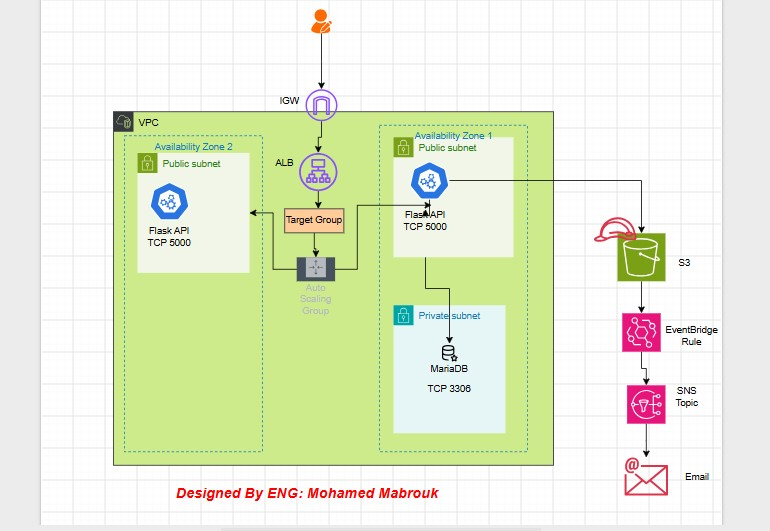

# Cloud Document Manager

A cloud-based document management application deployed on AWS.

The project demonstrates how to deploy a Flask application on EC2 using an
Application Load Balancer and Auto Scaling, connect the application to Amazon RDS,
store documents in Amazon S3, and send email notifications when objects are
deleted from S3.

## Architecture

The application follows a 3-tier architecture:




## Application Features

* Upload documents
* Store document files in Amazon S3
* Store document information in Amazon RDS
* List uploaded documents
* Download documents
* Delete documents
* Health check endpoint for the Load Balancer
* Send notifications to Your Email in case deleting object of S3

## Environment Variables

The application uses the following environment variables that store in our EC2s that auto scaling group create them:

```text
DB_HOST
DB_PORT
DB_NAME
DB_USER
DB_PASSWORD
S3_BUCKET
AWS_REGION
```

## Steps to create this project by yourself

### 1. AWS Region
The project was deployed in:
```
us-east-1
```
2.Create the S3 Bucket and called 
```
document-manager-602
```
3.Create Amazon RDS Database with these configuration or configuration related you but note use new configuration in our script after you download it
```
Engine: MariaDB
Database name: document_manager
Master username:admin
database password: admin1234
```
**After creating the database, copy the RDS endpoint**
```
database-1.xxxxxxxxxxxx.us-east-1.rds.amazonaws.com
```
This endpoint will be used in the EC2 configuration.

4.Configure RDS Security Group
Create or use a Security Group for RDS.

Allow:
```
Type: MySQL/Aurora
Port: 3306
Source: EC2 Security Group
```
5.Create IAM Role for EC2 to access S3

6.Create a Security Group for the template instances.

Allow the required application traffic.
```
HTTP
TCP
Port 5000
Source: Load Balancer Security Group
```
and
```
SSH
TCP
Port 22
Source: Your IP
```

7.Prepare the Template User Data. from Ec2 file in our Repo
```
#!/bin/bash

REPO_DIR="/opt/job-app-repo"

GITHUB_REPO="https://github.com/mohamedmabrouk-666/Cloud-Document-Manager"

sudo apt-get update -y

sudo apt-get install -y git

sudo git clone --depth 1 --branch main "$GITHUB_REPO" "$REPO_DIR"

bash "$REPO_DIR/Ec2.sh"
```
8.  Configure Ec2.sh with your Data
   
 **Update the values before launching the instances**
```
AWS_REGION="us-east-1"

S3_BUCKET="bucket_name"

DB_HOST="YOUR_RDS_ENDPOINT"

DB_NAME="document_manager"

DB_USER="admin"

DB_PASSWORD="admin1234"
```

9.  Create Target Group
 Configure:
```
Protocol:
HTTP

Port:
5000
```
10.  Create Application Load Balancer

11.  Create Auto Scaling Group
Select the previously created:
```
Launch Template
Target Group
```
12.  Test the Application

copy the DNS Of Application Load Balancer like this
```
my-load-balancer-xxxxxxxx.us-east-1.elb.amazonaws.com
```
and Open:
```
http://my-load-balancer-xxxxxxxx.us-east-1.elb.amazonaws.com
```
 13.  create S3 Event Notifications

The project uses Amazon EventBridge to detect deleted S3 objects.

14.  Create SNS Topic

15.  Create EventBridge Rule

16.  Test S3 Delete Notification


## What you Practiced in this project 

Through this project, You practiced:

* Building a 3-tier application architecture
* AWS VPC networking
* Public and private subnets
* EC2 deployment
* Application Load Balancer
* Auto Scaling
* Amazon RDS
* Amazon S3
* IAM roles and permissions
* Security Groups
* EventBridge
* SNS email notifications
